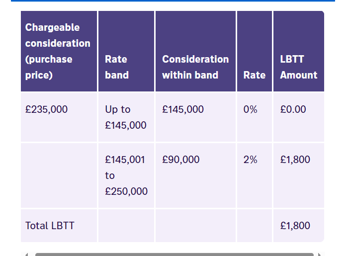

*LBTT TASK*

Context: Buying a house in Scotland incurs a tax which varies due to price of the house and buyer circumstances. EG: higher rate for buying second home.

Write a piece of code which given the price of a house will calculate LBBT due to be paid.

Simplicity help:
- Buyer currently already owns a property and lives in it as their main residence.
- buyer doesn't conduct any business from their house
- buyer does not own other properties
- intention of buyer is to sell their current home at the same day they buy it.

Expectations:
- Compile without error
- Have runnable Unit test
- Have those Unit tests pass

TIPS: 
- keep functionality as simple as possible
- Doesn't need to cover all possible scenarios yet: if it is based off of one price range then this needs to be covered in tests
- Don't move far beyond the minimum

OFFICIAL REVENUE SCOTLAND WEBSITE:

https://revenue.scot/taxes/land-buildings-transaction-tax

Information on LBTT with specification:
- Going to be a residential property - used or suitable as a dwelling or adapted for use as a dwelling (for now focus on that, work on Additional Dwelling Supplement later) Extra - ADS does not apply in this example as buyer sells their first home on the same day as buying their second home.
- Purchase prices and LBTT RATE: 
Purchase price | LBTT rate
 Up to £145,000	| 0%
 £145,001 to £250,000	| 2%
 £250,001 to £325,000	| 5%
 £325,001 to £750,000	| 10%
 Over £750,000	| 12%

 - Calculate the tax per band - Example of £400k house being calculated:
£0 - £145k x 0% = £0
£145,001 - £250k | £105k x 2% = £2100
£250,001 - £325k | £75k x 5% = £3750
£325,001 - £400k | £75k x 10% = £7500
Total LBTT = £13,350 

Plan: 
Take user input of the houe price they are buying
calculate the difference from minimum house price in current tax band to the inputted house price
calculate the percentage tax based on that difference
if the house price is above a certain tax band, add the maxium amount of tax in that band EG: £250k and over - 2% tax band always = £2100
total the amount from each tax band and return the amount
Add error handling if input is empty
report error if input is invalid
report error if input is below £0

Note: the calculator on official website always rounds down. As if the decimals don't even matter